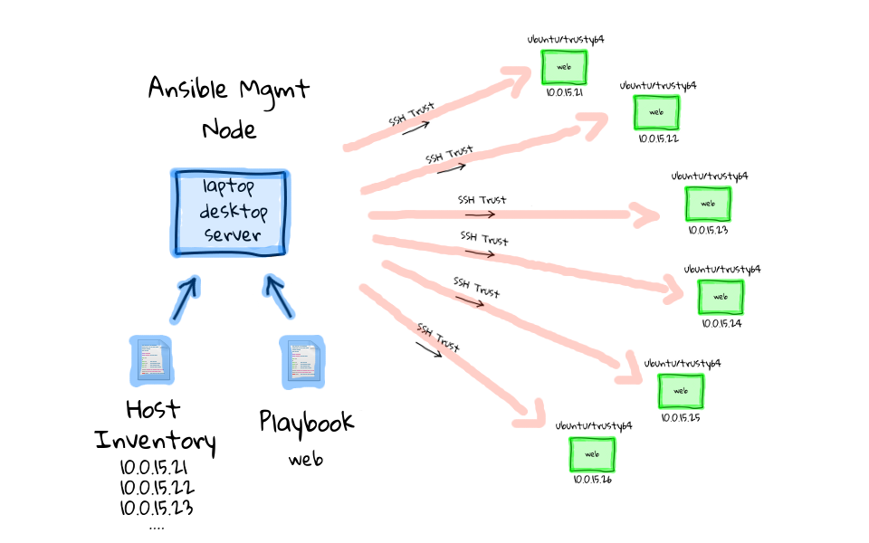

# Ansible tutorial


Ansible is a configuration management software that lets you control and
configure nodes from  another machine. What makes it different from other
management software is that ansible  uses (potentially existing) SSH
infrastructure, while others (chef, puppet, ...) need a specific PKI
infrastructure to be set-up.

Ansible also emphasises push mode, where configuration is pushed from a master
machine (a master machine is only a machine where you can SSH to nodes from) to
nodes, while most other CM typically do it the other way around (nodes pull
their config at times from a master machine).

This mode is really interesting since you do not need to have a 'publicly'
accessible 'master' to be able to configure remote nodes: it's the nodes
that need to be accessible (we'll see later that 'hidden' nodes can pull their
configuration too!), and most of the time they are.


# Uses

- Use cases
    - Provisioning
    - Configuration management
    - App deployment
    - Continuous delivery
    - Security & compliance
    - Orchestration
- Integrations
    - Infrastructure
    - Networks
    - Containers
    - Cloud
    - Services & applications

[Reference](https://www.ansible.com/red-hat)


# Architecture




# Schedule

- Day 1: Ansible Fundamentals
- Day 2: Beyond the basics: Roles, Modules, Encryption, Management
- Day 3: Applied Ansible


# Notes

Etherpad: https://beta.etherpad.org/p/vgansible


# Initial setup

First, download the [Vagrantfile](Vagrantfile) providing the environment for our class.


Bring up vagrant boxes:

```
vagrant up
```

When finished, connect to control machine:

```
vagrant ssh control
```

On control machine:

```
# generate SSH keypair for deployment to managed hosts
ssh-keygen

# install required packages
sudo apt-get install -y python-yaml python-jinja2 python-paramiko python-crypto git

# install ansible
cd /vagrant
./ubuntu_install_ansible.sh

# clone this repo on the control machine
git clone https://github.com/gossetx/ansible.git
cd ansible
```

Reference: [Installing Ansible](http://docs.ansible.com/ansible/intro_installation.html)


## Terminology

Reference: [Ansible Glossary](https://docs.ansible.com/ansible/glossary.html):
 - [command or action](https://docs.ansible.com/ansible/intro_adhoc.html): [ansible module](https://docs.ansible.com/ansible/modules.html) like just a shell command. Intro in [step-02](https://github.com/gossetx/ansible/tree/master/step-02).
 - task: it's combine an action (a module and its arguments) with a name and optionally some other keywords (like looping directives).
 - [playbook](https://docs.ansible.com/ansible/playbooks_intro.html): an yaml file contains roles executed in sequence, and eventually individual tasks. Intro in [step-04](https://github.com/gossetx/ansible/tree/master/step-04).
 - [role](https://docs.ansible.com/ansible/playbooks_roles.html): an organisational unit grouping tasks together in order to install a piece of software. Intro in [step-12](https://github.com/gossetx/ansible/tree/master/step-12).
